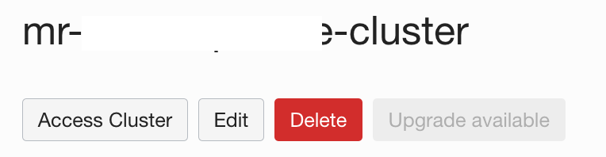
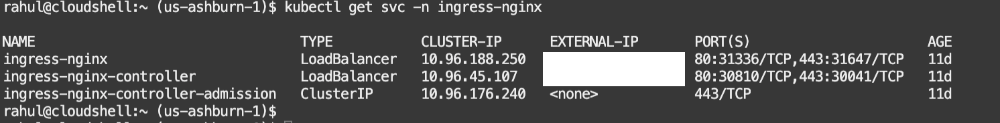
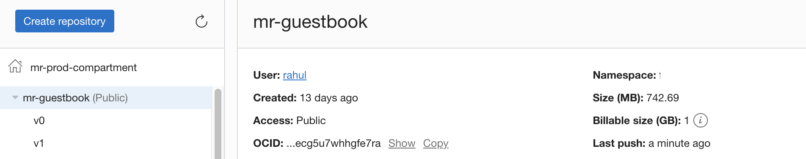
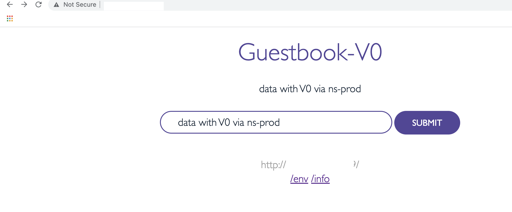

An illustration of OCI Deployment Canary strategy with a stateful application.
---

Context

-------

- The illustration provides a deployment flow of a sample application with a stateful data source shared across .
- The deployment follows [OCI Canary Deployment strategy model](https://docs.oracle.com/en/solutions/plan-mad-strats-devops/understand-depoyment-architectures.html#GUID-1E607CF8-3446-476F-9372-355937F209ED).
- Objective herer to ensure data consistency across canary and production stages (with in the same stateful datasource).
- Here the focus is only for OCI Deployment pipeline ,but the same can be integrated along with other OCI devops services as well (Build,Code repo etc)



Application catography

---
- Sample application build using Guestbook app - https://kubernetes.io/docs/tutorials/stateless-application/guestbook/ 
- Stateful database is build using redis - inspired by blog by Okteto -  https://www.okteto.com/blog/connect-applications-across-namespaces/ 
- We will be using Oracle Kubernetes Engine (OKE) for application deployment.
Procedure

---

- Create an OCI Dynamic group and add below rules.

```
ALL {resource.type = 'devopsdeploypipeline', resource.compartment.id = 'ocid1.compartment.xxxx'}

```

- Create an OCI Policy as below.

```
Allow dynamic-group <DG NAME> to manage repos in compartment <COMPARTMENT NAME>
Allow dynamic-group <DG NAME> to manage generic-artifacts in compartment <COMPARTMENT NAME>
Allow dynamic-group <DG NAME> to use ons-topics in compartment <COMPARTMENT NAME>
Allow dynamic-group <DG NAME> to read all-artifacts in compartment <COMPARTMENT NAME>
Allow dynamic-group <DG NAME> to manage cluster-family in compartment <COMPARTMENT NAME>
```


- Create an OCI Container registry repo (enable as public repo ) - https://docs.oracle.com/en-us/iaas/Content/Registry/home.htm



- Create an OKE - https://docs.oracle.com/en-us/iaas/Content/ContEng/Tasks/contengcreatingclusterusingoke_topic-Using_the_Console_to_create_a_Quick_Cluster_with_Default_Settings.htm#create-quick-cluster



- We are using NGINX to switch the traffic between two namespaces (Canary and Production).
- To do so , Use ``Access Cluster option `` of OKE ,launch the cloud shell and set the config to access the cluster.



- We will be following the procedure mentioned [here](https://docs.oracle.com/en-us/iaas/Content/ContEng/Tasks/contengsettingupingresscontroller.htm) to setup the ingress controller.

```
$ kubectl create clusterrolebinding <my-cluster-admin-binding> --clusterrole=cluster-admin --user=<user-OCID>
$ export version="Latest Nginix release version " - https://github.com/kubernetes/ingress-nginx#support-versions-table
$ kubectl apply -f https://raw.githubusercontent.com/kubernetes/ingress-nginx/controller-${version}/deploy/static/provider/cloud/deploy.yaml
$ Validate the Nginx installation.
```



- Create the docker images and push to the OCI Artifact registry

```markdown
$ git clone <REPO URL>
$ cd <REPO NAME>/
$ docker build -t <OCI REGION>.ocir.io/<NAMESPACE>/<REPO NAME>:v0 -f Dockerfile_v0 . # Create image with version V0.
$ docker build -t <OCI REGION>.ocir.io/<NAMESPACE>/<REPO NAME>:v0 -f Dockerfile_v1 . # Create image with version V1.
$ docker push <OCI REGION>.ocir.io/<NAMESPACE>/<REPO NAME> # Push both the images back to the OCI artifact repo.
```

- Validate the images are visible under the Container registry repo created.



- Create an OCI Notification topic which will be associated with devops project - https://docs.oracle.com/en-us/iaas/Content/Notification/home.htm
- Create a new Devops Project - https://docs.oracle.com/en-us/iaas/Content/devops/using/devops_projects.htm



- Ensure to enable logs for the OCI Devops Projects.




- Create an OCI Devops environment (type as Oracle Kubernetes Engine) - https://docs.oracle.com/en-us/iaas/Content/devops/using/create_oke_environment.htm


- Create an OCI devops artifact with type 'Kubernetes manifest' and store the artifacts from file [guestbook_app.yaml](appConfig/guestbook_app.yml)


- Create another  OCI devops artifact with type 'Kubernetes manifest' and store the artifacts from file [redis.yaml](appConfig/redis.yml)



- Create an OCI deployment pipeline for the Redis DB deployment.
- With in the deployment pipeline add a deployment stage as type `Apply manifest to Your Kubernetes`



- Associate with the `OKE devops environment` and `Redis.yaml` artifact . Use the namespace as `ns-prod` to deploy the DB under production namespace.



- Create anothe OCI devops deployment pipeline for the application with Canary deployment.
- Use 'Canary Strategy' as the stage type.



- Select the deployment type as OKE , use `ns-canary` as canary namespace and and `ns-prod` for production namespace.
- Associate it with the guest book artifacts created.

- Use `guestbook-ingress` as the NGINX ingress name.
- Use ramp limit as 25% under canary shift so that 25 % of traffic will be served via the new version.



- You may skipp the validation step and add at least one as approval count .





- The final view of deployment pipeline is as below .



- Let us do the db deployment , to do so ,use the `redis db` pipeline created and execute it via `Run pipeline
option.



- Wait for all the steps to complete .



- Validate the redis deployment using `kubectl` over cloudshell .

```markdown
$ kubectl get all -n ns-prod |grep -i redis
$ kubectl logs -n ns-prod pod/redis-0
```



- Switch to the deployment pipeline created for guestbook.
- Add two deployment parameters as below 

```markdown
- "version" with no default value ,its the docker image version that will be used .
- "redis_hosts" with default value as redis.ns-prod.svc.cluster.local ,its the service endpoint to access the redis db.
 ```



- Do a manual run of the guestbook deployment pipeline with image version as `v0`.



- Since its the first deployment  we wont be seeing any canary shift as it needs ingress controller to be established (at least one time) with in the namespaces.
- So approve the stage annd complete untill the last step for the deployment.





- Wait for all the deployment steps to complete .



- To validate the application ,switch to `OCI Cloud shell and use Kubectl`.

```markdown
$ kubectl get all,ing -n ns-prod
```



- Fetch the Ingress public ip and use a browser to view the application .



- Please note you may have a different color ,which is perfectly ok ,but if you see an error stating `Waiting for DB connection` , recheck your redis_url and redis deployment ,as it is unable to connect to the data base

- Let us add some data to the application and press submit.









