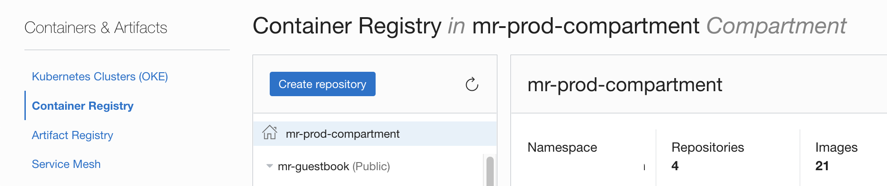
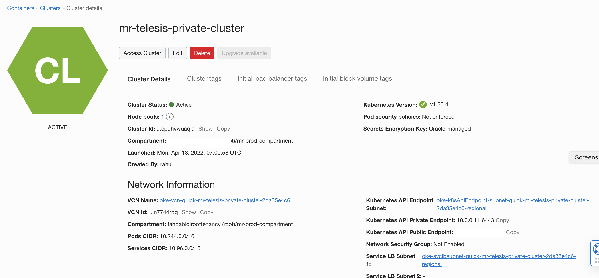

An illustration of OCI Deployment Canary strategy with a stateful application .
---

Context

-------

- The illustration provides a deployment flow of a sample application with a stateful data source shared across .
- The deployment follows [OCI Canary Deployment strategy model](https://docs.oracle.com/en/solutions/plan-mad-strats-devops/understand-depoyment-architectures.html#GUID-1E607CF8-3446-476F-9372-355937F209ED).
- Objective herer to ensure data consistency across canary and production stages (with in the same stateful datasource).
- Here the focus is only for OCI Deployment pipeline ,but the same can be integrated along with other OCI devops services as well (Build,Code repo etc)


Application catography

---
- Sample application build using Guestbook app - https://kubernetes.io/docs/tutorials/stateless-application/guestbook/ 
- Stateful database is build using redis - inspired by blog by Okteto -  https://www.okteto.com/blog/connect-applications-across-namespaces/ 
- We will be using Oracle Kubernetes Engine (OKE) for application deployment.
Procedure

---

- Create an OCI Dynamic group and add below rules.

```
ALL {resource.type = 'devopsdeploypipeline', resource.compartment.id = 'ocid1.compartment.xxxx'}

```

- Create an OCI Policy as below.

```aidl
Allow dynamic-group <DG NAME> to manage repos in compartment <COMPARTMENT NAME>
Allow dynamic-group <DG NAME> to manage generic-artifacts in compartment <COMPARTMENT NAME>
Allow dynamic-group <DG NAME> to use ons-topics in compartment <COMPARTMENT NAME>
Allow dynamic-group <DG NAME> to read all-artifacts in compartment <COMPARTMENT NAME>
Allow group <DG NAME> to manage cluster-family in compartment <COMPARTMENT NAME>
```


- Create an OCI Container registry repo (enable as public repo ) - https://docs.oracle.com/en-us/iaas/Content/Registry/home.htm



- Create an OKE - https://docs.oracle.com/en-us/iaas/Content/ContEng/Tasks/contengcreatingclusterusingoke_topic-Using_the_Console_to_create_a_Quick_Cluster_with_Default_Settings.htm#create-quick-cluster



- We are using NGINX to switch the traffic between two namespaces (Canary and Production).
- To do so , Use ``Access Cluster option `` of OKE ,launch the cloud shell and set the config to access the cluster.


- We will be following the procedure mentioned [here](https://docs.oracle.com/en-us/iaas/Content/ContEng/Tasks/contengsettingupingresscontroller.htm) to setup the ingress controller.

```aidl
$ kubectl create clusterrolebinding <my-cluster-admin-binding> --clusterrole=cluster-admin --user=<user-OCID>
$ export version="Latest Nginix release version " - https://github.com/kubernetes/ingress-nginx#support-versions-table
$ kubectl apply -f https://raw.githubusercontent.com/kubernetes/ingress-nginx/controller-${version}/deploy/static/provider/cloud/deploy.yaml
$ Validate the Nginx installation.
```


- Create an OCI Notification topic which will be associated with devops project - https://docs.oracle.com/en-us/iaas/Content/Notification/home.htm
- Create a new Devops Project - https://docs.oracle.com/en-us/iaas/Content/devops/using/devops_projects.htm


- Ensure to enable logs for the OCI Devops Projects.


- Create an OCI Devops environment (type as Oracle Kubernetes Engine) - https://docs.oracle.com/en-us/iaas/Content/devops/using/create_oke_environment.htm


- Create an OCI artifact with type 'Kubernetes manifest' and store the artifacts from file [guestbook_app.yaml](appConfig/guestbook_app.yml)
- 


